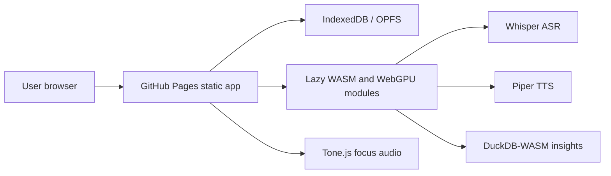

# Gentle ADHD Flow


Live site: https://baditaflorin.github.io/gentle-adhd-flow/

Repository: https://github.com/baditaflorin/gentle-adhd-flow

Support: https://www.paypal.com/paypalme/florinbadita

Local-first ADHD self-management: messy typed, pasted, uploaded, dragged, or microphone-captured brain dumps become tasks, focus sessions, habits, and gentle planning. The app is a pure GitHub Pages static site: no backend, no accounts, no secrets in the frontend, and personal data stays in browser storage.


## Quickstart

```bash
npm install
make dev
make test
make build
make pages-preview
```

## Verified Features

- Text brain dumps can be typed, pasted, loaded from `.txt` / `.md` / `.csv` / `.json` files, dragged onto the capture box, or read from the clipboard.
- Capture drafts autosave locally and survive reloads until cleared.
- Extraction creates editable task cards, gentle habit rows, and capture history.
- Focus mode records local focus sessions and respects the selected duration and soundscape.
- Voice cue honors the Settings voice toggle; microphone transcription degrades with an actionable fallback if local Whisper is unavailable.
- Settings exports a versioned JSON state file and imports both versioned exports and legacy raw v1 snapshots.
- Plans can be copied to clipboard, printed/PDFed through the browser, or shared through a small `#state=` URL when the state is small enough.
- Build metadata is visible in the footer, and the footer links back to the GitHub repository so visitors can star it.

## Limitations

- Arbitrary URL import is not built because GitHub Pages cannot bypass CORS for user-supplied sites; paste rendered text or upload a note file instead.
- OCR/image input is not built.
- Local Whisper/Piper assets are large and lazy-loaded; browser/device support varies.
- Share links are only for small snapshots. Use Export for serious backup or larger workspaces.
- There is no cross-device sync server; state lives in the current browser profile unless exported.

## Architecture



## Documentation

Architecture decisions: https://github.com/baditaflorin/gentle-adhd-flow/tree/main/docs/adr

Deploy notes: https://github.com/baditaflorin/gentle-adhd-flow/blob/main/docs/deploy.md

Privacy notes: https://github.com/baditaflorin/gentle-adhd-flow/blob/main/docs/privacy.md

Postmortem: https://github.com/baditaflorin/gentle-adhd-flow/blob/main/docs/postmortem.md

Phase 3 postmortem: https://github.com/baditaflorin/gentle-adhd-flow/blob/main/docs/postmortem-phase3.md
