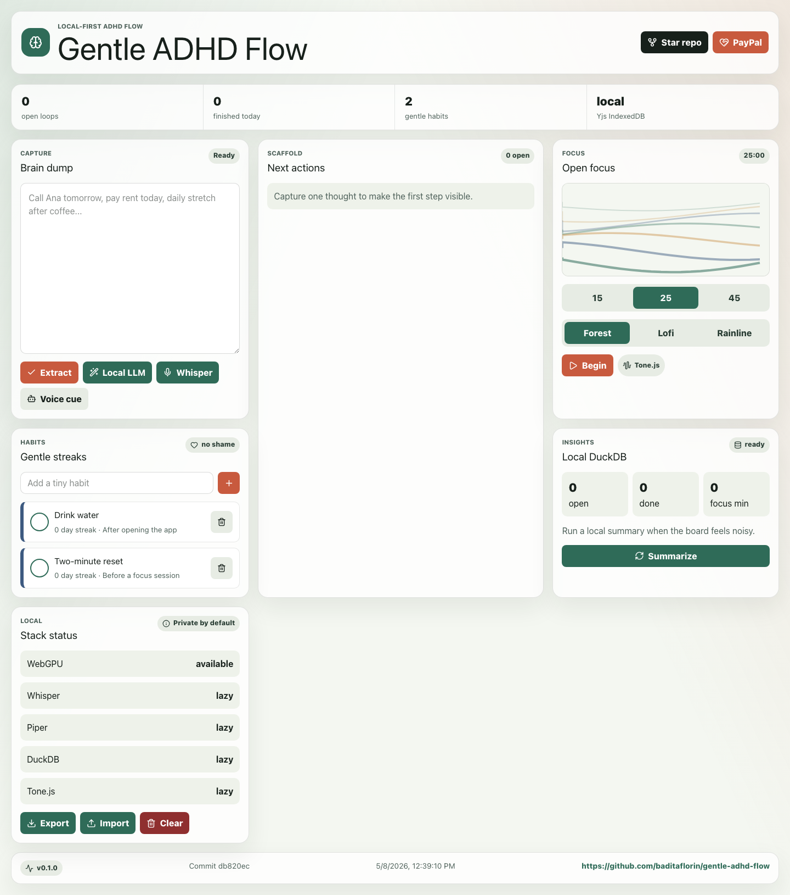
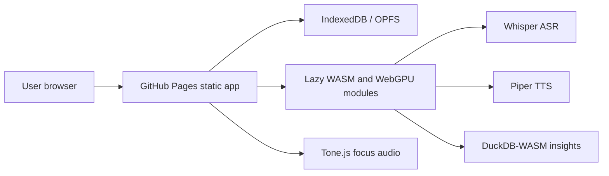

# Gentle ADHD Flow


Live site: https://baditaflorin.github.io/gentle-adhd-flow/

Repository: https://github.com/baditaflorin/gentle-adhd-flow

Support: https://www.paypal.com/paypalme/florinbadita

Local-first ADHD self-management: voice brain-dumps become tasks, focus sessions, habits, and gentle planning. The v1 app is a pure GitHub Pages static site: no backend, no accounts, no secrets in the frontend, and personal data stays in browser storage.



## Quickstart

```bash
npm install
make dev
make test
make build
make pages-preview
```

## Status

V1 is live. Build metadata is visible in the footer of the published app, and the footer links back to the GitHub repository so visitors can star it.

## Architecture



## Documentation

Architecture decisions: https://github.com/baditaflorin/gentle-adhd-flow/tree/main/docs/adr

Deploy notes: https://github.com/baditaflorin/gentle-adhd-flow/blob/main/docs/deploy.md

Privacy notes: https://github.com/baditaflorin/gentle-adhd-flow/blob/main/docs/privacy.md

Postmortem: https://github.com/baditaflorin/gentle-adhd-flow/blob/main/docs/postmortem.md
