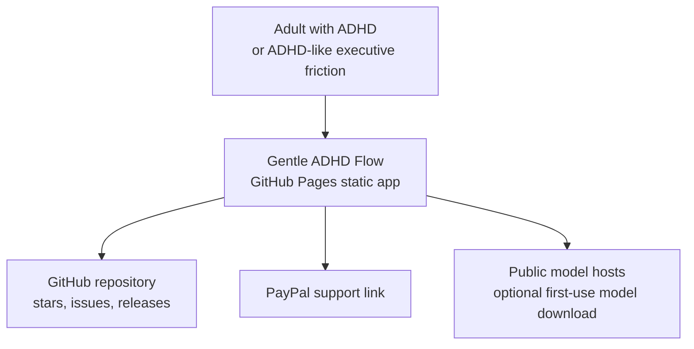
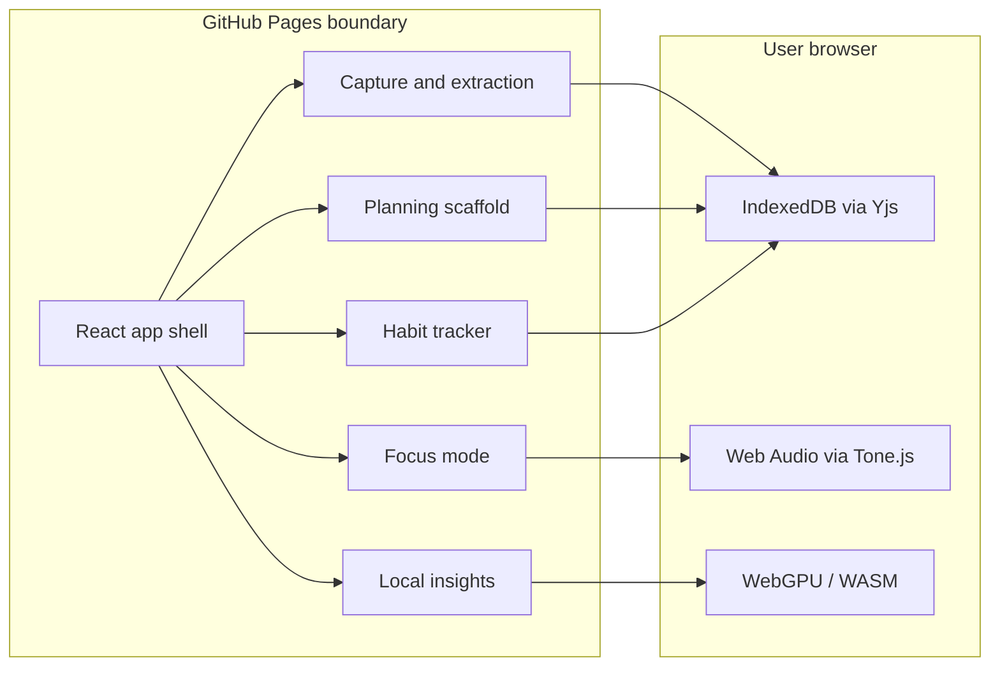

# Architecture

Live site: https://baditaflorin.github.io/gentle-adhd-flow/

Repository: https://github.com/baditaflorin/gentle-adhd-flow

## C4 Context

## C4 Container

## Boundaries

The frontend is the runtime. GitHub Pages serves static files only. The app does not send user brain-dumps, task lists, habit logs, or focus sessions to a project backend.
